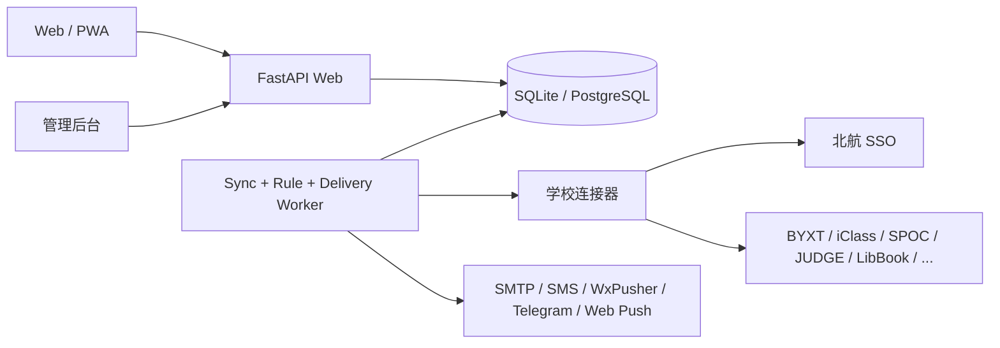
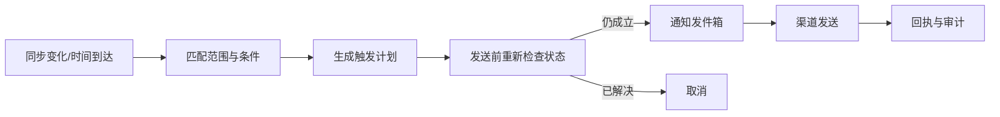

# PUAA Reminder 系统架构

## 1. 架构形态

采用可拆分的 Python 模块化单体：一个代码库、清晰领域边界、本地可合并运行、生产可分离 Web 与 Worker。它避免早期微服务开销，同时不把同步、规则和通知耦合在 HTTP 请求中。



### 本地一键模式

- SQLite WAL；
- Web 和 Worker 同一进程；
- `start.ps1` / `start.sh` 启动；
- 适合个人开发和少量用户。

### Docker Compose 模式

- `web`、`worker`、`postgres` 三个服务；
- 不依赖 Redis；
- 数据库承担任务租约与通知发件箱；
- `docker compose up -d` 完成启动。

## 2. 模块边界

| 模块 | 责任 | 禁止承担 |
|---|---|---|
| `identity` | PUAA 注册、登录、会话、角色 | 学校 SSO |
| `vault` | 用户敏感配置加密、密钥版本 | 业务解析 |
| `school_auth` | 每个用户的 SSO Cookie、重登、访问模式 | PUAA 登录 |
| `connectors` | 上游认证、拉取、解析、写操作 | 通知投递 |
| `calendar` | 事件系列、出现实例、合并、覆盖 | 上游 HTTP |
| `rules` | 条件、时间锚点、状态变化、取消 | 渠道 SDK |
| `scheduler` | 数据库任务、租约、退避、限流 | 业务解析 |
| `notifications` | 渠道配置、模板、投递、回执 | 学校同步 |
| `sources` | 自定义/共享来源与订阅 | 任意代码执行 |
| `audit` | 安全与写操作审计 | 敏感明文 |

模块通过应用服务和数据契约交互，不直接读取其他模块的私有表。

## 3. 多用户身份与凭据

### 3.1 PUAA 登录

- 密码使用 Argon2id 哈希；
- Web 使用服务器会话和 `HttpOnly + SameSite=Lax` Cookie；
- 登录、注册、修改敏感配置需要 CSRF 防护；
- 会话支持设备列表、单设备退出和全部退出；
- 管理员不能查看用户学校密码。

### 3.2 学校凭据

敏感值放入 `secret_blobs`：

- AES-256-GCM 信封加密；
- 主密钥由 `PUAA_MASTER_KEY` 提供，不入库；
- 每条密文包含 `key_version`、nonce 和认证标签；
- 密码保存是用户显式选择，默认只保存 Cookie 与派生 token；
- Cookie、SPOC token、图书馆 token 等均加密；
- 密钥轮换通过后台任务逐条重加密。

### 3.3 租户隔离

- 所有用户业务表强制包含 `user_id`；
- Repository 的入口必须接收当前用户上下文；
- Worker 任务同时携带 `user_id` 和 `connection_id`；
- 唯一键包含 `user_id`，禁止跨用户去重；
- 管理后台只读聚合健康数据，不展示日程标题和凭据。

## 4. 连接器协议

每个学校系统是独立连接器，不共享“万能 token”。

```python
class Connector(Protocol):
    manifest: ConnectorManifest

    async def authenticate(self, context: AuthContext) -> AuthResult: ...
    async def probe(self, context: ConnectorContext) -> HealthResult: ...
    async def sync(self, context: ConnectorContext, cursor: SyncCursor) -> SyncBatch: ...
    async def execute(self, context: ConnectorContext, action: ActionRequest) -> ActionResult: ...
```

`ConnectorManifest` 声明：

- 连接器 ID、版本和支持的访问模式；
- 提供的事件、待办、状态和动作；
- 默认同步周期和动态时间窗；
- 所需秘密、权限和速率限制；
- 数据保留与失效判定。

`SyncBatch` 包含：

- 标准事件系列与出现实例；
- 状态快照；
- 下一游标；
- 警告与数据新鲜度；
- 原始记录摘要和响应结构版本。

### 连接状态机

```text
unbound → authenticating → healthy
                         ↘ captcha_required
healthy → degraded → login_required → authenticating
   ↑          ↓             ↓
   └──── recovered       disabled
```

错误必须分类，不能都归为 `error`：

- `network_unreachable`
- `login_required`
- `captcha_required`
- `credential_rejected`
- `rate_limited`
- `upstream_changed`
- `partial_data`
- `action_rejected`

## 5. 标准日历模型

单一 `events` 表不足以表达重复课程、截止任务和状态变化，因此采用系列与实例分离。

### `event_series`

- `id`, `user_id`, `connector_id`, `external_key`
- `kind`, `title`, `description`, `location`
- `term_code`, `course_code`, `rrule`
- `source_revision`, `first_seen_at`, `last_seen_at`
- `raw_ref`, `deleted_at`

### `event_occurrences`

- `id`, `series_id`, `user_id`
- `starts_at`, `ends_at`, `due_at`, `all_day`, `timezone`
- `status`, `status_changed_at`
- `source_fresh_at`, `source_stale_after`
- `dedupe_key`, `superseded_by`

### `event_overrides`

保存用户对标题、颜色、提醒、隐藏状态等覆盖，防止下次同步覆盖用户选择。

### `state_snapshots`

保存签到、提交、成绩、可用座位、跑步进度等状态，规则引擎可以判断“仍未签到”或“从无成绩变为有成绩”。

## 6. 同步与任务调度

### 数据库任务

`jobs` 表保存：

- `type`, `user_id`, `connection_id`
- `run_at`, `priority`, `attempt`
- `lease_owner`, `lease_until`
- `dedupe_key`, `payload`, `last_error`

本地 SQLite 只运行一个 Worker。PostgreSQL Worker 使用行锁领取任务，可水平扩展。失败采用指数退避和连接器级熔断。

### 动态轮询

- 课表、考试、成绩：低频轮询；
- 作业：截止前提高频率；
- 签到：只在有关课程时间窗内高频轮询；
- 座位开放：由用户启用的观察任务决定频率；
- 所有轮询加入抖动并尊重学校系统限流。

### 同步提交

一次同步在事务内：

1. 保存原始记录摘要；
2. upsert 系列与实例；
3. 写入状态快照；
4. 标记消失记录但不立即删除；
5. 生成变化事件；
6. 提交游标；
7. 唤醒规则评估。

空响应只有在连接器确认“有效空列表”后才能覆盖旧数据。

## 7. 提醒规则

规则由结构化字段组成，不运行用户代码：

```json
{
  "scope": {"kinds": ["signin"], "connector": "iclass"},
  "when": {"anchor": "ends_at", "offset_minutes": -30},
  "if": [{"field": "status", "op": "eq", "value": "missing"}],
  "repeat": {"every_minutes": 10, "until": "ends_at"},
  "cancel_if": [{"field": "status", "op": "eq", "value": "done"}],
  "deliver": [{"channel": "email"}, {"channel": "sms", "after_minutes": 20}]
}
```

规则流程：



`scheduled_triggers` 和 `notification_deliveries` 都有幂等键，重复同步不会重复发送。

## 8. 通知渠道

统一渠道接口：

- `validate_config()`
- `send(message, idempotency_key)`
- `query_receipt()`（渠道支持时）

支持：用户 SMTP、用户短信网关、WxPusher、Telegram、站内通知、Web Push。消息模板只使用经过白名单过滤的字段，防止来源内容注入 HTML。

## 9. 自定义与共享来源

### 用户来源

- 手工事件；
- ICS URL/文件；
- 受限 HTTP JSON 来源；
- Webhook 推送；
- 管理员安装的隔离 Python 插件。

HTTP JSON 来源使用声明式映射：认证头、请求周期、JSONPath/JMESPath 字段映射和时间格式。禁止任意脚本、内网地址和未授权重定向，防止 SSRF。

### 共享空间

用户发布的是**模板**，不包含密钥和个人 URL。订阅者单独填写凭据。模板需要版本、权限声明、审核状态、变更日志和撤回机制。

## 10. 数据库与迁移

- ORM：SQLAlchemy 2；
- 迁移：Alembic；
- 本地：SQLite WAL；
- Compose：PostgreSQL；
- 测试：SQLite 单元测试 + PostgreSQL 集成测试；
- 删除账户：软删除等待期后清除事件、密文、通知和审计中的个人载荷。

## 11. 可观测性

- 结构化日志只记录连接器、耗时、状态码分类和匿名用户 ID；
- 指标：同步成功率、数据新鲜度、任务延迟、通知成功率、连接器熔断数；
- 审计：登录、凭据变更、学校写操作、共享模板发布；
- 健康页按连接器显示，不泄露个人数据。
